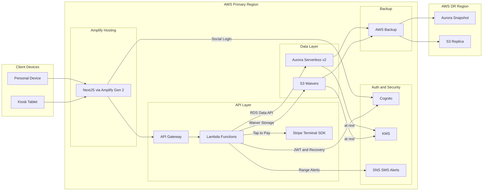
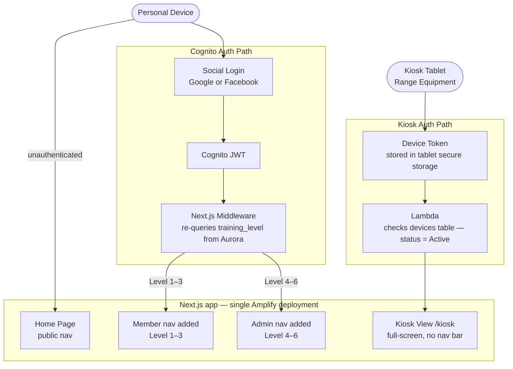

# System Architecture — Outdoor Sports Club

This diagram shows the full AWS-hosted system: client surfaces, the **AWS Amplify Gen 2** frontend, the **API Gateway** / **Lambda** backend, the **Aurora Serverless v2** data layer, auth and security services, and the cross-region backup topology.

## Flow Notes

| Flow | Description |
| :--- | :--- |
| Home Page / Member Device → Amplify | Public visitors and authenticated members hit the **Next.js** frontend hosted on **AWS Amplify Gen 2** — it is the same single app for all personal device users |
| Kiosk Tablet → Amplify | Paired range tablets also load the Next.js app from **Amplify**, navigating directly to the full-screen `/kiosk` route; the kiosk never uses the Cognito login flow |
| Amplify → Cognito | Personal device login uses **AWS Cognito** Social Login (Google / Facebook); on success, the nav menu expands based on `training_level` re-queried from Aurora — members (Level 1–3) see member items, staff (Level 4–6) see admin items |
| Amplify → API Gateway | Authenticated frontend calls hit **API Gateway**, which routes to the appropriate **Lambda** function |
| Lambda → Aurora | All reads and writes use the **RDS Data API** — no persistent DB connections inside Lambda |
| Lambda → S3 | Signed waivers are written to **Amazon S3** with **S3 Object Lock** (Compliance Mode, 7-year retention) |
| Lambda → Stripe Terminal | Guest fees and consumable purchases are processed via the **Stripe Terminal SDK** (Tap to Pay) |
| Lambda → Cognito | Admin recovery endpoints clear `social_provider_id` directly in the **Cognito User Pool** |
| Lambda → SNS | Range-closure and safety alerts are published to **Amazon SNS** for SMS delivery |
| Aurora / S3 → KMS | All stored data is encrypted at rest via **AWS KMS** |
| Aurora / S3 → AWS Backup | **AWS Backup** captures continuous PITR snapshots and replicates them cross-region for disaster recovery |

## RBAC

Two auth paths control access within a single Next.js app hosted on Amplify. For personal devices, Cognito Social Login grants a JWT; the nav menu then expands based on `training_level` re-queried from Aurora — the JWT claim is never trusted for this. For kiosk tablets, a Device Token is validated directly by Lambda on every request, bypassing Cognito entirely. The `training_level` value stored in **Aurora** is always the source of truth.

### Surface routing

### API enforcement

Every Lambda invocation enforces RBAC independently of the surface routing above:

| Enforcement point | Mechanism |
| :--- | :--- |
| API Gateway — web routes | Cognito Authorizer rejects missing or invalid JWTs before Lambda is invoked |
| API Gateway — kiosk routes | No Cognito Authorizer; Lambda validates the Device Token directly |
| Lambda — web | Re-queries `training_level` from Aurora on every request; never trusts the JWT claim |
| Lambda — kiosk | Validates Device Token on every request; a `Revoked` or missing record is rejected immediately |

### Training level reference

| Level | Designation | Nav visibility | Capabilities |
| :--- | :--- | :--- | :--- |
| 0 | Guest | Kiosk only | Waiver + fee at kiosk; no app login |
| 1 | Probationary | Member nav | Basic member items; range access pending 6 service hours |
| 2 | Basic Member | Member nav | Check-in to basic facilities (Skeet, Trap, Archery) |
| 3 | Qualified | Member nav | Adds specialized Rifle / Pistol ranges |
| 4 | RSO / Instructor | Admin nav | Open/close ranges; clear violation alerts |
| 5 | Administrator | Admin nav | Finance, database, and rules oversight |
| 6 | Webmaster | Admin nav | Full system access; device pairing; account recovery |

## Extensibility Notes

### Adding a new surface

Adding a 5th client surface (e.g., an Instructor Portal) is a coordinated multi-layer change, not a single-file addition. The following layers all require updates:

| Layer | What changes |
| :--- | :--- |
| Frontend | New App Router route group with its own layout and middleware guard |
| Cognito | New user pool group for the role (e.g., `training_officer`) |
| Lambda authorizer / middleware | New role added to the allow-list for any shared endpoints; new endpoints added for surface-specific operations |
| CloudFormation | IAM execution role updated if the surface's Lambdas need new AWS permissions |
| API Gateway | New routes wired to new Lambda functions |

The primary friction is the **RBAC boundary**: each surface must be consistently enforced across the Amplify middleware, the API Gateway Cognito Authorizer, and any Lambda business logic that checks `training_level`. A mismatch at any layer creates a security gap. Adding a range type (a data-only change) does not have this coupling.

If a future increment adds enough surfaces that the multi-layer coordination becomes burdensome, the RBAC middleware could be made data-driven — role → allowed routes declared in a config table rather than hardcoded conditionals. That tradeoff is not warranted for the current four surfaces.
