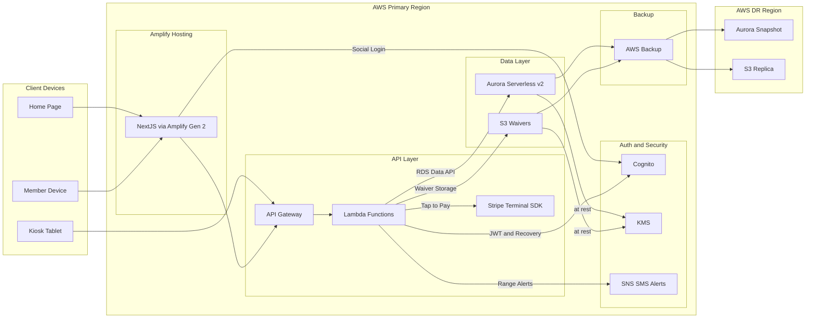

# System Architecture — Outdoor Sports Club

This diagram shows the full AWS-hosted system: client surfaces, the **AWS Amplify Gen 2** frontend, the **API Gateway** / **Lambda** backend, the **Aurora Serverless v2** data layer, auth and security services, and the cross-region backup topology.

## Flow Notes

| Flow | Description |
| :--- | :--- |
| Home Page / Member Device → Amplify | Public visitors and authenticated members hit the **Next.js** frontend hosted on **AWS Amplify Gen 2** |
| Kiosk Tablet → API Gateway | Paired kiosks speak directly to the API using a **Device Token** — they never go through the website |
| Amplify → Cognito | Website login uses **AWS Cognito** Social Login (Google / Facebook); post-login, users are routed to the **Member Portal** or **Admin Portal** by `training_level` |
| Amplify → API Gateway | Authenticated frontend calls hit **API Gateway**, which routes to the appropriate **Lambda** function |
| Lambda → Aurora | All reads and writes use the **RDS Data API** — no persistent DB connections inside Lambda |
| Lambda → S3 | Signed waivers are written to **Amazon S3** with **S3 Object Lock** (Compliance Mode, 7-year retention) |
| Lambda → Stripe Terminal | Guest fees and consumable purchases are processed via the **Stripe Terminal SDK** (Tap to Pay) |
| Lambda → Cognito | Admin recovery endpoints clear `social_provider_id` directly in the **Cognito User Pool** |
| Lambda → SNS | Range-closure and safety alerts are published to **Amazon SNS** for SMS delivery |
| Aurora / S3 → KMS | All stored data is encrypted at rest via **AWS KMS** |
| Aurora / S3 → AWS Backup | **AWS Backup** captures continuous PITR snapshots and replicates them cross-region for disaster recovery |
