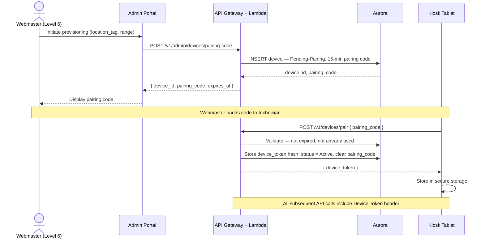
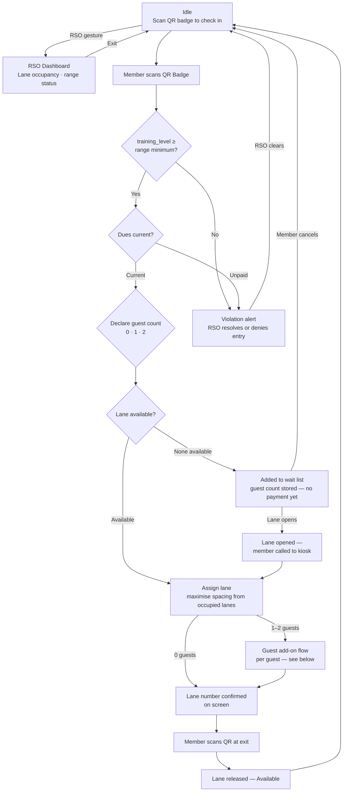
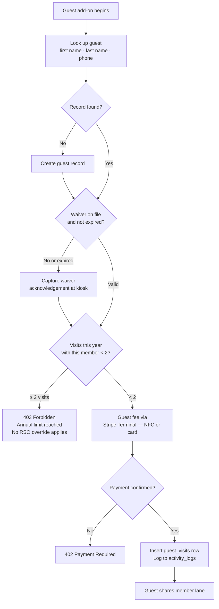
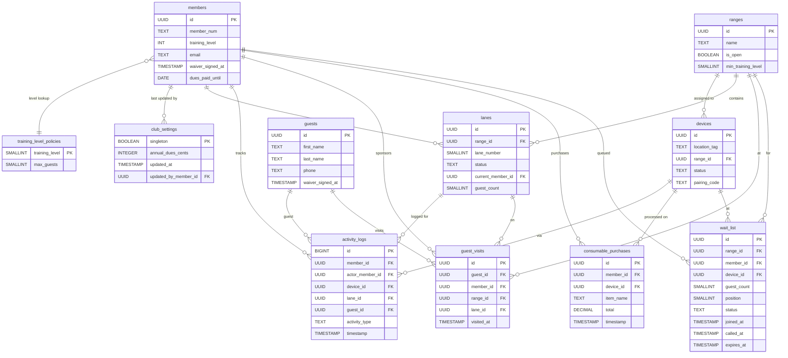
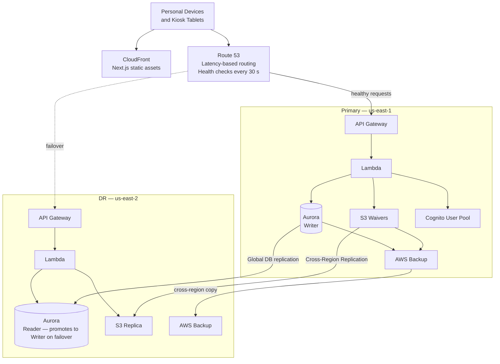

# design.md

## 1. Training-Centric Access Schema (RBAC)

The system's **Role-Based Access Control (RBAC)** is driven by the user's verified "Training Level." This controls nav visibility in the **web app** and acts as a safety gate at the **Mobile Kiosks**.

The application is a single **Next.js** app hosted on **AWS Amplify Gen 2**. The **Home Page** is the public-facing entry point visible to all visitors. After **AWS Cognito** login on a personal device, the nav menu expands based on the user's `training_level` fetched via a backend API call (**Lambda** re-queries **Aurora** via **RDS Data API**): members (Levels 1–3) see member-specific items and staff/admins (Levels 4–6) see additional management items. The **Kiosk View** is a dedicated full-screen route (`/kiosk`) within the same app, served to paired range tablets — it is accessed exclusively via Device Token and is entirely separate from the personal device login flow.

| Level | Designation | Digital Permissions | Range & System Logic |
| :--- | :--- | :--- | :--- |
| **0** | **Guest** | Waiver & Payment | Must pay guest fee and sign digital form at Kiosk. |
| **1** | **Probationary** | Range Access | Restricted range access pending completion of 6 volunteer service hours (tracked manually by Administrator). |
| **2** | **Basic Member** | General Access | Unlocks check-in for basic facilities (Skeet, Trap, Archery). |
| **3** | **Qualified** | Specialized Access | Verified Qualification unlocks specialized Rifle/Pistol ranges. |
| **4** | **RSO / Instructor** | Range Ops | Can "Open/Close" ranges and override guest limits. |
| **5** | **Administrator** | Business Oversight | **Full Business Access:** Finance, Database, and Rules. |
| **6** | **Webmaster** | **Technical Oversight** | **Full System Access:** API logs, Device Pairing, and Recovery. |

### Level progression

All level changes are explicit **Administrator (Level 5+)** actions in the Admin Portal — no automated promotion occurs.

```mermaid
flowchart LR
    G["Level 0<br/>Guest<br/>Kiosk only"]
    P["Level 1<br/>Probationary<br/>Pending 6 service hours"]
    BM["Level 2<br/>Basic Member<br/>Skeet · Trap · Archery"]
    Q["Level 3<br/>Qualified<br/>Adds Rifle / Pistol"]
    RSO["Level 4<br/>RSO / Instructor<br/>Opens and closes ranges"]
    ADM["Level 5<br/>Administrator<br/>Finance and oversight"]
    WM["Level 6<br/>Webmaster<br/>Full system access"]

    G -->|Admin promotes| P
    P -->|6 service hours + Admin promotes| BM
    BM -->|Qualification training + Admin promotes| Q
    Q -->|RSO cert + Admin promotes| RSO
    RSO -->|Admin promotes| ADM
    ADM -->|Admin promotes| WM
```



## 2. Kiosk Identity & Device Provisioning (AWS)

To ensure high-speed check-ins and eliminate the security risks of social login on shared tablets, the system utilizes **Secure Device Pairing**:

* **Pairing Workflow:** A **Webmaster (Level 6)** initiates device provisioning via the Admin Portal, which generates a short-lived **Pairing Code**. The Webmaster hands the code to the technician configuring the tablet; the tablet uses the code to complete pairing and receive its Device Token.
* **Kiosk Token:** Once paired, the server issues a unique **Device Token** stored in the tablet's secure storage. The tablet then functions as a trusted appliance.
* **Revocation:** If a tablet is lost or stolen, the **Webmaster** sets the device's `status` to `Revoked` in the `devices` table via the Admin Portal. The next API request from that tablet will be rejected immediately.

### Pairing sequence



## 3. Member Identity & Recovery Protocol

* **Personal Devices:** Members use **Social Login (Google/Facebook)** via **AWS Cognito** on their own phones/computers to access the **Member Portal**. The portal is the primary self-service surface for members: it displays their profile and dues standing, allows them to update contact details and phone number, enables online dues payment via **Stripe.js** (card element — no NFC hardware required), and displays their QR badge for range check-in. The portal is designed to be extended with additional member-facing features over time.
* **Account Recovery (The "Un-Link" Protocol):** If a member loses access to their social account, the **Webmaster (Level 6)** executes the following:
    1. **Identity Verification:** Member presents their physical badge/ID to an **Admin** or **Webmaster**.
    2. **Token Reset:** The **Webmaster** clears the `social_provider_id` in the **Cognito User Pool** for that record.
    3. **Re-Link:** On the next login attempt, the member uses their *new* social account; the system recognizes the email/ID match and re-binds the profile.
* **The Digital Badge:** The portal generates a unique **Member QR Badge**. This badge is the "Key" that the tokenized Kiosk recognizes to log a check-in or verify a Training Level.

## 4. Operational Track (Mobile Kiosk)

### Physical kiosk model

Staffed ranges (Rifle/Pistol, Skeet/Trap, and staffed Archery and Air Rifle) each have 2–3 tablet kiosks. Unstaffed ranges (outdoor Archery and indoor Air Rifle when not staffed) do not have kiosks — no check-in flow applies.

Tablets are standard RSO range equipment. The RSO carries the tablet, presents it to arriving members for check-in, and retains custody throughout their shift. The tablet is tracked as range equipment — the RSO on duty is responsible for its whereabouts. This is the **RSO-mediated** model: the RSO is physically present at every check-in transaction, can tap their own NFC badge immediately when a violation alert fires, and returns the tablet to Idle after each completed workflow.

### Kiosk states

| State | Description |
| :--- | :--- |
| **Idle** | Default view. Prompts the member to scan their QR badge. Displayed at startup and after every completed check-in, check-out, or cancelled workflow. |
| **Check-in flow** | Initiated when a member scans their QR badge. System validates `training_level`, dues, and declared guest count. |
| **RSO Dashboard** | Lane occupancy display for this kiosk's range: each lane shows `Available`, `Occupied` (with occupant name/member number and guest count), or `Closed`. Accessible from the idle screen via **RSO NFC badge scan**: the RSO taps their member badge; the kiosk reads `member_id`, queries `training_level` from Aurora, and admits access only if Level ≥ 4. The RSO's `member_id` is recorded as `actor_member_id` on any action taken within the dashboard. Lane state is re-fetched after every check-in and check-out transaction, and polled every 30 seconds. RSOs can close or re-open individual lanes directly from this view — for example, to take a lane out of service due to a physical hazard. Only `Available` lanes may be closed; an `Occupied` lane must be checked out before it can be closed. The RSO Dashboard also supports **administrative force-checkout**: the RSO can explicitly clear an occupied lane directly from the dashboard (e.g., after verifying the occupant has vacated during a weather closure or emergency). Force-checkout writes a `Range-Checkout` activity log entry with the RSO's `actor_member_id` for audit purposes, and advances the wait list if any entries are queued. |
| **Guest add-on** | After a lane is assigned (either directly or after being called from the wait list), the kiosk runs the guest add-on flow for each declared guest: waiver check, annual-limit check, and payment via **Stripe Terminal**. No payment is taken before a lane is confirmed. |
| **Violation alert** | Displayed when check-in fails a rule (e.g., guest limit exceeded, waiver expired, insufficient level). The member cannot dismiss this screen. The RSO taps their own NFC badge to authenticate (Level ≥ 4 required); the kiosk then presents two choices: **(a) Approve override** — entry is allowed and the exception is recorded in `activity_logs` against the RSO's `member_id`; **(b) Deny entry** — check-in is cancelled and the lane remains `Available`. |
| **Lane assignment** | Once the member has declared their guest count and a lane is available, the system assigns the lane that maximises spacing from occupied groups based on the declared group size. The confirmed lane number is shown on screen. Guest waiver and payment are then processed per guest. |
| **Wait list** | Displayed when all lanes are occupied. The kiosk shows the member's current position in the queue. The member may cancel and leave at any time. When a lane opens, the kiosk calls the next member in the queue and advances to lane assignment. |
| **Check-out flow** | RSO-initiated or user-initiated. Member scans QR Badge; open lane assignment (including all guests on that lane) is closed, the lane returns to `Available`, and the wait list is advanced if any entries are queued. |

### Check-in workflow



### Guest add-on flow

Run once per guest — up to two guests per check-in.



### Flow rules

* **The "Safety Gate":** Automated blocking of check-ins for members with insufficient `training_level` for a specific range.
* **Mandatory Check-Out:** Range users must check out before leaving. Check-out closes the lane assignment (including all guests) and logs a `Range-Checkout` event.
* **Violation lock:** A failed check-in locks the screen in violation state. The RSO resolves — approve an override where policy allows, or deny entry. Only Level 4+ can clear a violation alert.
* **Lane assignment:** Each member check-in assigns one available lane. Member and all their guests share that lane. Only lanes with `status = 'Available'` are eligible — `Occupied` and `Closed` lanes are excluded from selection. When multiple eligible lanes exist, the system selects the lane that maximises physical distance from all currently occupied lanes — preferring lanes whose nearest occupied neighbour is as far away as possible. This distributes groups across the range rather than clustering them adjacently. When no `Available` lanes exist (all lanes are either `Occupied` or `Closed`) the member is offered a wait list position instead of a hard block.
* **Wait list:** When the range is full, the kiosk adds the member to the wait list for that range (`wait_list` table) and displays their queue position. When any lane is released via check-out, the system automatically advances the queue: the next `Waiting` entry is promoted to `Called`, the RSO Dashboard (if open) will surface the `Called` status on its next lane-occupancy poll, and (if the member has a `mobile_phone` on record) an **Amazon SNS** SMS is sent. The called entry expires after 5 minutes (`expires_at`); if not acted on it is marked `Expired` and the next entry is advanced. A member may cancel their wait list entry at any time from the kiosk screen.
* **Guest accompaniment:** Guests must be physically present with and accompanied by their sponsoring member. A guest cannot arrive independently — there is no guest-only entry flow. The guest add-on step at the kiosk (after lane assignment) is the only entry point for guest registration and payment.
* **Guest sponsorship:** A member may bring a maximum of **2 guests per range visit**. The limit is enforced per range — a member may not bring more than 2 guests on the same range at the same time. Guest count is stored in `lanes.guest_count` and checked at check-in.
* **Guest check-in order:** The member declares guest count (0, 1, or 2) before the lane check. The declared count is used to score lane selection but no guest processing occurs at this stage. Once a lane is assigned — either immediately or after being called from the wait list — the kiosk runs the guest add-on flow for each guest: waiver acknowledgement, annual-limit check, and payment via **Stripe Terminal** (Tap to Pay). Either the guest or the sponsoring member may pay. If the member was on the wait list and declines or leaves before a lane opens, no payment has been taken.
* **Cashless Kiosk Payments:** All kiosk payments (guest fees, annual dues, consumables) are processed via the **Stripe Terminal SDK**. NFC Tap to Pay — using the tablet's built-in NFC chip — is the primary method and requires no additional hardware. For members who cannot present a contactless payment, a **Stripe Terminal hardware reader** (e.g., Stripe Reader M2, connected via Bluetooth) paired to the kiosk tablet provides card insert and swipe as a fallback. Neither raw card data nor card numbers are ever stored on Club-managed systems.
* **Consumable Sales:** Members and guests may purchase consumables (e.g., targets, canned soda, coffee) at the kiosk. Each transaction is recorded in the `consumable_purchases` table with full line-item detail. Payment is processed via **Stripe Terminal SDK** (Tap to Pay). **Known Limitation:** There is no reliable physical process to verify that recorded quantities match items actually dispensed; the system records what is entered at the kiosk but cannot enforce inventory accuracy.
* **Time-Bound Waivers:** Automated re-signing triggers for Safety Waivers based on 1-year expiration logic.
* **Tablet Hardware Requirement:** Kiosk tablets **must have an accessible NFC chip** to support Tap to Pay as the primary payment method. Most modern Android tablets and iPads qualify. Budget or older Android tablets may omit NFC — verify hardware specs before purchasing. For card-insert/swipe fallback, a **Stripe Terminal hardware reader** (e.g., Stripe Reader M2) is paired to each kiosk tablet via Bluetooth. The fallback reader is optional but recommended for each kiosk station.

### Offline operation

If internet connectivity is lost, the kiosk must continue to support member check-in and check-out using a locally cached dataset. Guest payment (Stripe Terminal) requires connectivity and cannot be processed offline. See **Open Design Question #10** for the offline architecture decisions.

## 5. Data Schema (Amazon Aurora Serverless v2)

The database utilizes a relational model (PostgreSQL) with **Row-Level Security (RLS)**. This ensures members can only access their own profiles, while Level 4–6 users have elevated visibility for range safety and system maintenance.

### Entity relationships



### **5.1 Table: `members`**

| Column | Type | Description |
| :--- | :--- | :--- |
| `id` | UUID (PK) | Internal unique identifier for all relational joins. |
| `member_num` | TEXT (Unique) | Physical badge number encoded in the **QR Badge**. |
| `email` | TEXT (Unique) | Primary contact and anchor for Social Login. |
| `training_level` | INT (0-6) | **The Master Key:** Determines base permissions. |
| `social_provider_id` | TEXT (Nullable) | Linked Google/Facebook ID (Cleared during **Recovery**). |
| `service_hours` | DECIMAL(5,2) | Running total for **Level 1** promotion tracking. |
| `waiver_signed_at` | TIMESTAMP | Used to calculate the 1-year automated expiration. |
| `dues_paid_until` | DATE | Membership standing flag. Always set to December 31 of the year in which dues are paid — membership covers the full calendar year (January 1 – December 31) regardless of payment date. |
| `home_phone` | TEXT (Nullable) | Home telephone number. |
| `mobile_phone` | TEXT (Nullable) | Mobile number in E.164 format (e.g., `+15551234567`); validated/normalized for **Amazon SNS** delivery of SMS range alerts. |

### **5.2 Table: `ranges`**

All physical ranges have a row in this table, regardless of whether they are currently staffed. The `ranges` table is the authoritative source for open/close state and access requirements. Unstaffed ranges (outdoor Archery, Air Rifle when unstaffed) do not have kiosk devices assigned to them, but they still appear here so that `min_training_level` and `is_open` are centrally managed for all ranges.

| Column | Type | Description |
| :--- | :--- | :--- |
| `id` | UUID (PK) | Unique range identifier. |
| `name` | TEXT (Unique) | Human-readable range name (e.g., `Rifle-Pistol`, `Skeet-Trap`). |
| `is_open` | BOOLEAN | `true` when the range is open for check-in. Closing a range prevents new check-ins but does not affect existing lane occupancy — lane state is preserved exactly as it is at the moment of closure. Five closure scenarios are recognised: **daily-close** (end of operating day), **weather** (outdoor range conditions unsafe or unsuitable), **partial** (a subset of lanes taken out of service — handled at the lane level via `lanes.status = 'Closed'` rather than this flag; `is_open` remains `true` while other lanes remain available), **incident** (safety event requiring the range to stop accepting new shooters mid-session), and **other** (RSO discretion). In all cases the RSO retains full visibility of who is on the range via the RSO Dashboard and clears lanes explicitly using the administrative force-checkout as each occupant vacates. |
| `min_training_level` | SMALLINT (0-6) | Minimum `training_level` required to check in at this range. Applied at check-in time; authoritative value always queried from this table, never from the device or JWT. |

**Initial seed data:**

| `name` | `is_open` | `min_training_level` |
| :--- | :--- | :--- |
| `Rifle-Pistol` | `false` | 1 |
| `Skeet-Trap` | `false` | TBD |
| `Air-Rifle` | `false` | TBD |
| `Indoor-Archery` | `false` | TBD |
| `Outdoor-Archery` | `false` | TBD |

*Names are provisional — confirm with club leadership before the seed migration is written. All ranges seed as closed. `min_training_level` values TBD.*

### **5.3 Table: `devices` (Kiosks)**

| Column | Type | Description |
| :--- | :--- | :--- |
| `id` | UUID (PK) | Unique hardware ID. |
| `device_token` | TEXT (Nullable) | Salted hash of the secret used for **Kiosk-to-API** authentication. Null until pairing is complete. |
| `location_tag` | TEXT | Human-readable name (e.g., `Skeet-Trap-1`). |
| `range_id` | UUID (FK) | FK to `ranges.id`. Determines which range this kiosk serves; used to look up `is_open` and `min_training_level` at check-in. |
| `status` | TEXT | `Pending-Pairing`, `Active`, `Revoked` |
| `pairing_code` | TEXT (Nullable) | Short-lived alphanumeric code generated by the Admin Portal during device provisioning. Single-use; cleared on successful pairing. Null for `Active` and `Revoked` devices. |
| `pairing_code_expires_at` | TIMESTAMP (Nullable) | Expiry time for the pairing code (15-minute TTL). Requests with an expired code are rejected. |

### **5.4 Table: `lanes`**

Each lane belongs to a range and tracks current occupancy. The `devices` table links kiosks to ranges; lanes belong to ranges, not to individual kiosk tablets.

| Column | Type | Description |
| :--- | :--- | :--- |
| `id` | UUID (PK) | Unique lane identifier. |
| `range_id` | UUID (FK) | FK to `ranges.id`. Replaces the former `range_tag` TEXT column. |
| `lane_number` | SMALLINT | Lane number within the range (e.g., 1–17 for Rifle-Pistol). |
| `status` | TEXT | `Available`, `Occupied`, `Closed`. `Closed` lanes are removed from service by an RSO (e.g., physical hazard, maintenance) and are excluded from check-in assignment until re-opened. Only `Available` lanes may be transitioned to `Closed`; an `Occupied` lane must be checked out first. |
| `guest_count` | SMALLINT | Number of guests currently sharing this lane with the sponsoring member (0–2). Always 0 when `status` is `Available` or `Closed`. |
| `current_member_id` | UUID (FK, Nullable) | FK to `members.id`; set on check-in, cleared on check-out. Nullable only when the lane is `Available`. Guests must be accompanied by a member — the lane is assigned to the sponsoring member's ID for the duration of the guest's occupancy. A null value always means the lane is unoccupied. |
| `checked_in_at` | TIMESTAMP (Nullable) | Time the lane was last claimed. |

**Constraints and indexes:**

* `UNIQUE (range_id, lane_number)` — no two lanes can share the same number within a range.
* `CHECK (status IN ('Available', 'Occupied', 'Closed'))`
* `CHECK (guest_count BETWEEN 0 AND 2)`
* `CHECK ((status IN ('Available', 'Closed') AND current_member_id IS NULL AND guest_count = 0) OR (status = 'Occupied' AND current_member_id IS NOT NULL AND guest_count BETWEEN 0 AND 2))` — enforces consistency between occupancy state, sponsoring member, and guest count. `Closed` lanes share the same null-member/zero-guest invariant as `Available` lanes.
* `INDEX ON (range_id, status)` — supports finding available/occupied lanes for a range.
* `INDEX ON (current_member_id)` — supports finding the lane a member is currently occupying.

### **5.5 Table: `activity_logs`**

| Column | Type | Description |
| :--- | :--- | :--- |
| `id` | BIGINT (PK) | High-volume log ID. |
| `member_id` | UUID (FK) | The member performing the action for kiosk-originated events (`Range-Checkin`, `Range-Checkout`, `Guest-Payment`, `Waiver-Signed`). For `Level-Change` events: the **target member** whose level was changed. For portal-originated events (`Dues-Payment` via personal device): the paying member. |
| `actor_member_id` | UUID (FK, Nullable) | The Administrator who performed the action. Populated for `Level-Change` events (resolved from JWT `sub` → `members.id` at write time); `NULL` for all kiosk-originated event types and member portal event types where `member_id` is the actor. |
| `device_id` | UUID (FK, Nullable) | Reference to the `devices` table. `NULL` for non-kiosk events (`Level-Change` performed from the Admin Portal; `Dues-Payment` completed via the Member Portal personal-device path). |
| `activity_type` | TEXT | `Range-Checkin`, `Range-Checkout`, `Guest-Payment`, `Waiver-Signed`, `Level-Change`, `Dues-Payment` |
| `lane_id` | UUID (FK, Nullable) | Lane associated with the activity. Populated for `Range-Checkin`, `Range-Checkout`, and `Guest-Payment` events so that payments can be tied to a specific range visit and lane for reconciliation and dispute resolution; `NULL` for `Waiver-Signed`, `Level-Change`, and `Dues-Payment` events which have no lane context. |
| `stripe_payment_intent_id` | TEXT (Nullable) | Stripe Payment Intent ID; populated for `Guest-Payment` and `Dues-Payment` events. For `Guest-Payment`, linked to the lane/visit via `lane_id`. For `Dues-Payment`, `lane_id` is `NULL` — the Payment Intent is linked directly to the member via `member_id`. |
| `guest_id` | UUID (FK, Nullable) | FK to `guests.id`; populated for `Guest-Payment` and `Waiver-Signed` events involving a guest. Null for all other activity types. |
| `timestamp` | TIMESTAMP | Audit-ready event time. |

### **5.6 Table: `training_level_policies`**

One row per training level. Stores scalar constraints enforced automatically at check-in. Admin-editable without a schema migration.

| Column | Type | Description |
| :--- | :--- | :--- |
| `training_level` | SMALLINT (PK, 0-6) | The member level this policy applies to. |
| `max_guests` | SMALLINT | Maximum number of guests a member at this level may bring per range visit. `0` means guests are not permitted. |

**Seed data:**

| `training_level` | `max_guests` | Notes |
| :--- | :--- | :--- |
| 0 | 0 | Guest — cannot sponsor guests |
| 1 | 0 | Probationary — guests not permitted |
| 2 | TBD | Standard — TBD |
| 3 | 2 | Qualified — up to 2 guests per visit |
| 4 | 2 | RSO/Instructor |
| 5 | 2 | Senior RSO |
| 6 | 2 | Webmaster |

*Level 2 `max_guests` to be confirmed. All other values are known.*

Enforced at check-in by querying `training_level_policies.max_guests` for the member's level and comparing against the requested guest count. Exceeding the limit triggers a violation alert (see ODQ #11).

### **5.7 Table: `consumable_purchases`**

| Column | Type | Description |
| :--- | :--- | :--- |
| `id` | UUID (PK) | Unique purchase record. |
| `member_id` | UUID (FK, Nullable) | Reference to `members` table; nullable for guest purchases. |
| `device_id` | UUID (FK) | Kiosk where the purchase was recorded. |
| `item_name` | TEXT | Name of the consumable (e.g., `targets`, `soda`, `coffee`). |
| `quantity` | INT | Number of units purchased. |
| `unit_price` | DECIMAL(6,2) | Price per unit at time of sale. |
| `total` | DECIMAL(8,2) | `quantity × unit_price`; computed at transaction time. |
| `stripe_payment_intent_id` | TEXT | Stripe Payment Intent ID for reconciliation and dispute resolution. |
| `timestamp` | TIMESTAMP | Audit-ready event time. |

### **5.8 Table: `guests`**

A persistent identity record for non-member visitors. Created on first visit; reused on subsequent visits so a valid waiver on file does not need to be re-signed.

| Column | Type | Description |
| :--- | :--- | :--- |
| `id` | UUID (PK) | Unique guest identifier. |
| `first_name` | TEXT | Guest first name. |
| `last_name` | TEXT | Guest last name. |
| `phone` | TEXT | Contact phone in E.164 format. Part of the composite lookup key. |
| `email` | TEXT | Guest email address. Part of the composite lookup key; also used for waiver delivery or future notifications. |
| `waiver_signed_at` | TIMESTAMP (Nullable) | Timestamp of the most recent waiver signing. Null until completed at the kiosk on first visit. Checked against the 1-year expiration rule on each visit. |
| `waiver_s3_key` | TEXT (Nullable) | S3 object key for the signed waiver document; stored with S3 Object Lock (Compliance Mode) consistent with member waivers. |

**Constraints and indexes:**

* `UNIQUE (first_name, last_name, phone, email)` — lookup composite key.
* `INDEX ON (last_name, phone, email)` — kiosk lookup during the guest add-on step.

### **5.9 Table: `guest_visits`**

One row per range visit per guest. Used to enforce the annual visit limit: a guest-member combination may visit at most twice per calendar year. Guests that reach the limit are turned away — no RSO override applies to this rule.

| Column | Type | Description |
| :--- | :--- | :--- |
| `id` | UUID (PK) | Unique visit record. |
| `guest_id` | UUID (FK) | FK to `guests.id`. |
| `member_id` | UUID (FK) | FK to `members.id` — the sponsoring member for this visit. |
| `range_id` | UUID (FK) | FK to `ranges.id` — the range visited. |
| `lane_id` | UUID (FK, Nullable) | FK to `lanes.id` — the lane assigned for this visit. |
| `visited_at` | TIMESTAMP | Visit timestamp; used to scope the annual limit check to the current calendar year. |
| `stripe_payment_intent_id` | TEXT (Nullable) | Stripe Payment Intent ID for the guest fee charged on this visit. Duplicated here for direct reconciliation without joining to `activity_logs`. |

**Annual limit check:** Query `guest_visits` using a timestamp range rather than `EXTRACT(YEAR …)` so the `(guest_id, member_id, visited_at)` index is used:

```sql
SELECT COUNT(*)
FROM guest_visits
WHERE guest_id  = $1
  AND member_id = $2
  AND visited_at >= date_trunc('year', now() AT TIME ZONE 'UTC')
  AND visited_at  < date_trunc('year', now() AT TIME ZONE 'UTC') + INTERVAL '1 year';
```

If the count is ≥ 2, the kiosk returns `403 Forbidden`. All times are stored and compared in UTC. A `guest_visits` row is inserted only after payment is confirmed. To prevent a race condition where two simultaneous guest-payment requests both pass the count check, the check and insert must execute within a single **serializable transaction** (or use `SELECT … FOR UPDATE` on the sponsoring member's lane record to serialize concurrent check-ins for the same member).

**Indexes:**

* `INDEX ON (guest_id, member_id, visited_at)` — annual count query.
* `INDEX ON (member_id)` — sponsor history lookup.

### **5.10 Table: `wait_list`**

One row per queued member per range visit attempt. Created when all lanes are occupied at check-in; consumed when a lane becomes available and the member is called forward.

| Column | Type | Description |
| :--- | :--- | :--- |
| `id` | UUID (PK) | Unique wait list entry. |
| `range_id` | UUID (FK) | FK to `ranges.id` — the range the member is queued for. |
| `member_id` | UUID (FK) | FK to `members.id` — the waiting member. |
| `device_id` | UUID (FK) | FK to `devices.id` — the kiosk where the member is waiting; used to display the call on the correct screen. |
| `guest_count` | SMALLINT | Number of guests the member intends to bring; validated again against `training_level_policies.max_guests` when the entry is called forward. |
| `position` | SMALLINT | Queue position within the range (1 = next). Recalculated on every cancellation or expiry. |
| `status` | TEXT | `Waiting`, `Called`, `Expired`, `Cancelled`, `Checked-In` |
| `joined_at` | TIMESTAMP | When the entry was created. |
| `called_at` | TIMESTAMP (Nullable) | When the entry was promoted to `Called`; used to calculate `expires_at`. |
| `expires_at` | TIMESTAMP (Nullable) | 5-minute TTL from `called_at`; entry is marked `Expired` and the queue is advanced if the member does not complete check-in by this time. |

**Constraints and indexes:**

* `CHECK (status IN ('Waiting', 'Called', 'Expired', 'Cancelled', 'Checked-In'))`
* `CHECK (guest_count BETWEEN 0 AND 2)`
* `CREATE UNIQUE INDEX ON wait_list (range_id, member_id) WHERE status IN ('Waiting', 'Called')` — a member may not hold more than one active position in the queue for the same range. This is a partial unique index, not a UNIQUE constraint; PostgreSQL does not support filtered UNIQUE constraints.
* `INDEX ON (range_id, status, position)` — queue advance query: `WHERE range_id = $1 AND status = 'Waiting' ORDER BY position LIMIT 1`.
* `INDEX ON (member_id, status)` — member cancellation and status lookup.

### **5.11 Table: `club_settings`**

A single-row configuration table. Stores club-wide scalars that Administrators may change over time without a schema migration. The singleton constraint ensures exactly one row always exists.

| Column | Type | Description |
| :--- | :--- | :--- |
| `singleton` | BOOLEAN (PK) | Always `TRUE`. `CHECK (singleton = TRUE)` enforces a single-row invariant. |
| `annual_dues_cents` | INTEGER | Annual membership dues in US cents (e.g., `7500` = $75.00). Stored as an integer to avoid floating-point rounding. Used by `POST /v1/members/me/dues` to create the Stripe Payment Intent amount. |
| `updated_at` | TIMESTAMP | Timestamp of the last change. |
| `updated_by_member_id` | UUID (FK, Nullable) | FK to `members.id` — the Administrator who last updated the row. |

**Constraints:**

* `CHECK (singleton = TRUE)` — enforces single-row invariant.
* `CHECK (annual_dues_cents > 0)` — dues must be a positive amount.

## 6. Infrastructure & Security (AWS)

* **Storage:** Signed waivers are stored in **Amazon S3** with **S3 Object Lock** (Compliance Mode) to prevent tampering or accidental deletion.
* **Notifications:** Urgent safety alerts or range closures are pushed via **Amazon SNS** (SMS) to ensure reach to 100% of members.
* **Zero-Trust Security:** Data is encrypted at rest and in transit via **AWS KMS**; no raw credit card data is ever stored on Club-managed systems.
* **Authorization invariant — `training_level`:** Every Lambda that gates access by training level **must re-query `training_level` from Aurora** on every request. It must never be read from the Cognito JWT claim. The JWT is used only to identify the caller (via `sub`); the authoritative level is always the database row. A member's level can be revoked between token issuance and token expiry — reading the claim would miss that change.

### Data durability

Every layer of the stack is designed so that a transient failure — power interruption, Lambda timeout, network blip — cannot silently discard in-flight data.

* **Aurora write quorum:** Aurora Serverless v2 writes to 4-of-6 storage nodes across three Availability Zones before acknowledging the write. A single node failure is transparent to the application.
* **Atomic transactions:** Every kiosk operation that touches multiple tables (lane assignment, guest payment, wait list advance) executes inside a single Aurora transaction via the **RDS Data API**. A Lambda timeout or network interruption mid-write causes Aurora to roll the transaction back in full — no partial records.
* **Client-side retry responsibility:** The kiosk and Member Portal must treat any `5xx` response as retriable. All write endpoints are designed to be duplicate-safe: idempotency keys (Stripe Payment Intent ID, `(member_id, activity_type, occurred_at)` composite) prevent duplicate records from retry storms.
* **Offline check-in / check-out event queue:** If internet connectivity is unavailable when a member checks in or out, the kiosk writes the event to a durable local queue stored in encrypted persistent storage on the device. The event survives app restarts and power cycles. As soon as connectivity restores, the kiosk flushes the queue to Aurora via the normal `POST /v1/kiosk/check-in` and `POST /v1/kiosk/check-out` endpoints. `activity_logs` entries are insert-only and idempotent on `(member_id, activity_type, occurred_at)` so replaying queued events on reconnect cannot produce duplicate records. No check-in or check-out event is ever discarded due to a connectivity gap. See **ODQ #10** for the full offline architecture specification (cache encryption, key management, conflict resolution on sync).
* **Stripe webhook durability:** Stripe retries failed webhook deliveries for up to 72 hours with exponential back-off. The webhook Lambda is idempotent on Payment Intent ID — a retry of an already-processed event is a no-op.
* **Stripe Terminal in-flight recovery:** The Stripe Terminal SDK tracks PaymentIntent state on the device. If connectivity drops mid-transaction, the SDK recovers the PaymentIntent state on reconnect and completes or cancels cleanly — no duplicate charges.
* **Future async workflows:** Any background processing added in future (e.g., audit log export per ODQ #15) must use **Amazon SQS** with a **Dead-Letter Queue (DLQ)**. Silent message drops — fire-and-forget Lambda invocations — are not permitted.

## 7. API Outlines (AWS-Native / RESTful)

The API layer is built using **AWS Lambda** and **Amazon API Gateway**, integrated via **AWS Amplify**.

### **7.1 Member Portal Operations**

* **`GET /v1/members/me`** (**Authenticated member**, Level 1–6)
  * **Logic:** Returns the authenticated member's own profile. `member_id` resolved from Cognito JWT `sub`; all fields queried from Aurora — never from the JWT claims. Also reads `club_settings.annual_dues_cents` so the Member Portal can display the current dues amount before the member initiates payment.
  * **Returns:** `200 OK` with `{ member_num, training_level, service_hours, dues_paid_until, waiver_signed_at, mobile_phone, annual_dues_cents }`.

* **`GET /v1/members/me/badge`** (**Authenticated member**, Level 1–6)
  * **Logic:** Returns the member's `member_num` for QR code display in the Member Portal. The frontend renders the `member_num` as a QR code; the kiosk scans and resolves it via `POST /v1/kiosk/check-in`.
  * **Returns:** `200 OK` with `{ member_num }`.

* **`PATCH /v1/members/me`** (**Authenticated member**, Level 1–6)
  * **Logic:** Updates the authenticated member's own editable profile fields. Accepted fields: `home_phone`, `mobile_phone`. `mobile_phone` is validated and normalised to E.164 format before storage — invalid numbers are rejected with `400 Bad Request`. Fields not present in the request body are left unchanged. `member_num`, `email`, `training_level`, `service_hours`, `dues_paid_until`, and `waiver_signed_at` are not updatable through this endpoint.
  * **Returns:** `200 OK` with the updated `{ home_phone, mobile_phone }`, `400 Bad Request` (invalid phone format), or `403 Forbidden`.

* **`POST /v1/members/me/dues`** (**Authenticated member**, Level 1–6)
  * **Logic:** Personal-device path. Initiates an annual dues payment via **Stripe.js** (card element — no NFC hardware required). The Lambda reads `annual_dues_cents` from `club_settings`, creates a **Stripe Payment Intent** for that amount, and returns the `client_secret` to the frontend. The Member Portal completes the card transaction client-side using the Stripe.js SDK. On payment confirmation, a Stripe webhook (`payment_intent.succeeded`) triggers a Lambda that sets `members.dues_paid_until = December 31 of the current calendar year` and appends an `activity_logs` entry with `activity_type = 'Dues-Payment'` (`device_id = NULL`). The webhook handler is idempotent — duplicate events for the same Payment Intent ID are ignored.
  * **Returns:** `200 OK` with `{ client_secret, annual_dues_cents }`, or `402 Payment Required` if Stripe rejects the request.

### **7.2 Kiosk Operations**

* **`GET /v1/kiosk/range/lanes`** (**Device Token** authenticated)
  * **Logic:** Returns current lane occupancy for the kiosk's own range (resolved from the Device Token's `range_id`). Used by the RSO Dashboard for the initial load, post-transaction re-fetch, and the 30-second background poll between transactions.
  * **Returns:** `200 OK` with `{ range_id, name, is_open, lanes: [{ lane_id, lane_number, status, current_member_id, member_num, guest_count, checked_in_at }] }`. `member_num` and `checked_in_at` are `null` when `status` is `Available`.

* **`POST /v1/kiosk/check-in`**
  * **Logic:** Triggered by a QR scan. Resolves the device's `range_id`, then validates: (1) `ranges.is_open = true`; (2) member `training_level ≥ ranges.min_training_level`; (3) dues current; (4) declared guest count ≤ `training_level_policies.max_guests` for this member's level; (5) no `wait_list` entry with `status = 'Waiting'` already exists for this member at this range (a `Called` entry is valid — the member is responding to the queue call and the entry is transitioned to `Checked-In` on successful lane assignment). If no lanes have `status = 'Available'` (all are `Occupied` or `Closed`), a `wait_list` row is inserted (storing `guest_count` for later lane scoring) and the response includes the queue position — no guest waiver or payment is taken at this point. If a lane is available, selects the lane that maximises distance from all occupied lanes (greatest gap by `lane_number`) considering the declared group size, and assigns it. Guest waiver and payment are processed after lane assignment via `POST /v1/kiosk/guest-payment`. All values queried from Aurora via the **RDS Data API** — never from the JWT or device record directly.
  * **Returns:** `200 OK` with `{ lane_number }` (lane assigned), `202 Accepted` with `{ wait_position }` (range full — added to wait list), or `403 Forbidden` (e.g., "Level 3 Required", "Guests not permitted at this level").

* **`POST /v1/kiosk/check-out`**
  * **Logic:** Triggered by a QR scan at range exit. Validates an active open `Range-Checkin` exists for the member on that device; clears the lane; writes a `Range-Checkout` record to `activity_logs`. After the lane is freed, advances the wait list: queries the next `Waiting` entry for this range ordered by `position`, sets its `status = Called`, records `called_at`, sets `expires_at = called_at + 5 minutes`, and (if the member has a `mobile_phone`) publishes an **Amazon SNS** SMS notification. The RSO Dashboard's 30-second poll surfaces the `Called` entry automatically.
  * **Returns:** `200 OK` (Check-Out Logged) or `404 Not Found` (no open check-in on record).

* **`DELETE /v1/kiosk/wait-list/{entry_id}`** (**Device Token** authenticated)
  * **Logic:** Cancels the calling member's active `wait_list` entry for this range. Sets `status = Cancelled`; recalculates `position` for all remaining `Waiting` entries in the range. The device's `range_id` must match the entry's `range_id` — a kiosk cannot cancel entries for a different range.
  * **Returns:** `200 OK` or `404 Not Found`.

* **`POST /v1/kiosk/guest-payment`**
  * **Logic:** Handles the full guest add-on flow for a single guest: (1) look up guest by `first_name`, `last_name`, and `phone` in `guests` — create a new record if not found; (2) check `guests.waiver_signed_at` — prompt waiver capture at the kiosk if no record exists or the waiver has expired; (3) query `guest_visits` for this guest-member combination in the current calendar year — if count ≥ 2, return `403 Forbidden` (hard block; no RSO override applies); (4) process the guest fee via **Stripe Terminal SDK** — NFC Tap to Pay (primary) or paired card reader (fallback); (5) insert a `guest_visits` row; (6) create an `activity_logs` entry with `guest_id` populated.
  * **Returns:** `200 OK`, `403 Forbidden` (annual limit reached), or `402 Payment Required` (Stripe failure).

* **`POST /v1/kiosk/consumable-purchase`**
  * **Logic:** Records one or more line items (item name, quantity, unit price) to `consumable_purchases`; processes payment via **Stripe Terminal SDK** — NFC Tap to Pay (primary) or paired card reader (fallback). `member_id` is optional — omit for anonymous guest purchases.
  * **Returns:** `200 OK` (Purchase Recorded) or `402 Payment Required` (Stripe payment failure).

* **`POST /v1/kiosk/dues`** (**Device Token** authenticated)
  * **Logic:** Kiosk path for annual dues payment via **Stripe Terminal** — NFC Tap to Pay (primary) or paired card reader (fallback). The request body carries the `member_num` (resolved from the scanned QR badge) and optionally the member's `member_id` if already resolved. The Lambda: (1) resolves the member from `member_num`; (2) reads `annual_dues_cents` from `club_settings`; (3) processes the payment via **Stripe Terminal SDK**; (4) on success, sets `members.dues_paid_until = December 31 of the current calendar year`; (5) appends an `activity_logs` entry with `activity_type = 'Dues-Payment'` and `device_id` set to the kiosk's device ID. The same `payment_intent.succeeded` webhook used by the personal-device path handles confirmation; the webhook is idempotent on Payment Intent ID.
  * **Returns:** `200 OK` with `{ dues_paid_until }`, `402 Payment Required` (Stripe failure), or `404 Not Found` (unrecognised `member_num`).

### **7.3 Administrative & Recovery**

* **`GET /v1/admin/ranges/occupancy`** (**Level 4+** RSO)
  * **Logic:** Returns current lane occupancy for all ranges. Each range entry includes `range_id`, `name`, `is_open`, and a list of lanes with their `status`, `lane_number`, `current_member_id` (if occupied), and `guest_count`. Intended for the supervisory cross-range view in the **Admin Portal** and mobile web. Polled by the client at a suitable interval (e.g., 30 seconds). No push mechanism required.
  * **Returns:** `200 OK` with an array of range occupancy objects.

* **`PATCH /v1/admin/members/reset-auth`** (**Level 6** **Webmaster** Only)
  * **Logic:** Clears the `social_provider_id` in the **Cognito User Pool** for the specific `member_id`.

* **`POST /v1/admin/devices/pairing-code`** (**Level 6** **Webmaster** Only)
  * **Logic:** Creates a new device row in `devices` (status `Pending-Pairing`) with a cryptographically random alphanumeric pairing code and a 15-minute expiry. The `location_tag` and `range_id` are set at this point. The Admin Portal displays the generated code for the Webmaster to hand to the technician configuring the tablet. A device row with an unexpired code for the same `location_tag` is rejected — preventing duplicate device creation.
  * **Returns:** `201 Created` with `{ device_id, pairing_code, expires_at }`.

* **`POST /v1/devices/pair`** (Unauthenticated — identified by Pairing Code)
  * **Logic:** Called by the tablet during initial setup. Validates the supplied `pairing_code` against `devices` — rejects if not found, already used, or expired. On success: generates a `device_token`, stores its salted hash in `devices.device_token`, sets `status = Active`, and clears `pairing_code` and `pairing_code_expires_at`. Returns the raw token to the tablet, which stores it in secure storage. This is the only time the raw token is transmitted.
  * **Returns:** `200 OK` with `{ device_token }` or `400 Bad Request` (invalid/expired code).

* **`PATCH /v1/admin/ranges/{range_id}/status`** (**Level 4+** RSO)
  * **Logic:** Sets `ranges.is_open` to `true` or `false`. Callable from both the **Admin Portal** and the **Kiosk View** RSO dashboard. Closing a range is always a soft operation — lane occupancy is preserved exactly as it is at the moment of closure regardless of the reason. Five closure scenarios are recognised: **daily-close** (end of operating day), **weather** (conditions unsafe or unsuitable), **partial** (a subset of lanes taken out of service — note: partial closure is handled at the lane level via `PATCH /v1/admin/lanes/{lane_id}` setting `status = 'Closed'`; `is_open` is not set to `false` for a partial closure while other lanes remain available), **incident** (safety event), and **other** (RSO discretion). The RSO Dashboard remains functional and continues displaying live lane occupancy while `is_open = false`, allowing the RSO to retain full visibility of who is on the range and clear lanes explicitly as each occupant vacates.
  * **Returns:** `200 OK` or `403 Forbidden`.

* **`POST /v1/admin/lanes/{lane_id}/checkout`** (**Level 4+** RSO)
  * **Logic:** Administrative force-checkout. Clears the specified occupied lane — sets `status = 'Available'`, clears `current_member_id`, `guest_count`, and `checked_in_at` — and writes a `Range-Checkout` entry to `activity_logs` with `actor_member_id` set to the RSO's `members.id` (resolved from JWT `sub`) for a full audit trail. After clearing the lane, advances the wait list identically to a standard member-initiated check-out: promotes the next `Waiting` entry to `Called`, records `called_at`, sets `expires_at`, and sends an **Amazon SNS** SMS if the member has a `mobile_phone` on record. Returns `409 Conflict` if the lane is not currently `Occupied` — only occupied lanes can be force-checked out; `Available` and `Closed` lanes are rejected.
  * **Returns:** `200 OK`, `403 Forbidden`, `404 Not Found`, or `409 Conflict` (lane not occupied).

* **`POST /v1/admin/lanes`** (**Level 4+** RSO)
  * **Logic:** Creates a new lane for a range. `range_id` and `lane_number` required.
  * **Returns:** `201 Created` or `409 Conflict` (duplicate lane number).

* **`PATCH /v1/admin/lanes/{lane_id}`** (**Level 4+** RSO)
  * **Logic:** Updates a lane's configuration or operational status. Accepts `lane_number` (renumbering) and/or `status` (`Available` or `Closed`). Setting `status = 'Closed'` takes a lane out of service — it will be excluded from all check-in assignment until re-opened (`status = 'Available'`). A lane with `status = 'Occupied'` cannot be closed directly; the occupant must check out first (`409 Conflict` returned). Callable from both the **Admin Portal** and the **Kiosk View** RSO dashboard.
  * **Returns:** `200 OK`, `404 Not Found`, or `409 Conflict` (attempted disable of an occupied lane).

* **`PATCH /v1/admin/members/{member_id}/level`** (**Level 5+** Administrator)
  * **Logic:** Updates `members.training_level` for the specified member. Requires `training_level` (0–6) in the request body. Re-queries the **target member's** current `training_level` from Aurora before applying the change and writes an `activity_logs` entry with `activity_type = 'Level-Change'`, `member_id` = target member, `actor_member_id` = the Administrator's `members.id` (resolved by looking up JWT `sub` in `members`). No automated promotion logic — all level changes are explicit Administrator actions.
  * **Returns:** `200 OK`, `400 Bad Request` (missing or out-of-range `training_level`), `403 Forbidden`, or `404 Not Found`.

* **`GET /v1/admin/settings`** (**Level 5+** Administrator)
  * **Logic:** Returns the current `club_settings` row.
  * **Returns:** `200 OK` with `{ annual_dues_cents, updated_at, updated_by_member_id }`.

* **`PATCH /v1/admin/settings`** (**Level 5+** Administrator)
  * **Logic:** Updates one or more fields in the `club_settings` row. Accepted fields: `annual_dues_cents`. Sets `updated_at = NOW()` and `updated_by_member_id` to the Administrator's `members.id` (resolved from JWT `sub`). Does not affect in-flight Stripe Payment Intents — any Payment Intent already created retains the amount from when it was initiated.
  * **Returns:** `200 OK` with the updated `{ annual_dues_cents, updated_at }`, or `400 Bad Request` (negative or zero amount).

## 8. High Availability, Multi-Region & Disaster Recovery

### Design principle: variable region count

The infrastructure is designed from the start to support any number of active regions. Region count is a **deployment-time parameter** — adding or removing a region requires a configuration change, not an architectural change. Initial deployment uses a single primary region. Multi-region active-active is enabled when the system is ready for production.

This principle is especially critical for payment processing: Stripe Terminal transactions must not be lost or duplicated during a regional failure.

### Regional stack

Each active region runs a complete, independent copy of:

* **API Gateway** — regional endpoint (not edge-optimised)
* **AWS Lambda** — all function code deployed identically per region
* **Amazon Aurora Serverless v2** — member of a **Global Database** cluster; one writer region, N reader regions; automatic failover promotes a reader to writer in under 60 seconds
* **Amazon S3** — waiver bucket with **Multi-Region Access Point (MRAP)** and **S3 Cross-Region Replication (CRR)** to all active region buckets; Object Lock preserved across replicas
* **AWS KMS** — multi-region keys (`mrk-` prefix) replicated to each active region; same key material, independent key ARNs per region
* **AWS Secrets Manager** — secrets replicated to each active region via Secrets Manager multi-region replication
* **AWS Cognito** — single User Pool in the primary region; regional Lambda@Edge or API Gateway endpoints proxy auth to the primary pool

### Regional topology

The diagram below shows the full two-region active-active deployment. Development and single-region production use only the primary region stack.



### Traffic routing

* **Amazon Route 53** with **latency-based routing** or **failover routing** directs traffic to the nearest healthy regional API Gateway endpoint
* **Route 53 Health Checks** monitor each regional endpoint; unhealthy regions are automatically removed from DNS within ~30 seconds
* The Next.js frontend (Amplify hosting) is globally distributed via CloudFront — no change needed per region

### Deployment model

| Phase | Region count | Configuration |
| :--- | :--- | :--- |
| Development (`dev` stack, `us-east-1`) | 1 | `RegionList: us-east-1` — separate stack from prod, no PII |
| Production launch | 1 (primary) | `RegionList: us-east-1` |
| Multi-region active-active | 2 | `RegionList: us-east-1,us-east-2` — Northern Virginia and Ohio; both regions actively serve traffic, with Ohio as the failover target if Northern Virginia is unavailable |

All CloudFormation stacks accept a `RegionList` parameter. Cross-region resources (Aurora Global Database secondary clusters, KMS replica keys, S3 CRR rules, Secrets Manager replicas) are conditionally created: if `RegionList` has only one entry, none of the replication resources are provisioned.

### Non-production environment

The `dev` environment is a **completely separate CloudFormation stack** from `prod`. It shares no AWS resources, no data, and no secrets with production.

**Privacy compliance requirement:** The `dev` database must never contain real member data. This is required for compliance with GDPR (EU) and CCPA (California). All test data must be synthetically generated. If a production data restore is ever needed for debugging, it must be anonymised before import — names, email addresses, phone numbers, and `social_provider_id` values must be replaced with synthetic values.

| Setting | `dev` | `prod` |
| :--- | :--- | :--- |
| Aurora min/max ACU | 0.5 / 2 | 2 / 16 |
| S3 Object Lock mode | Governance (deletable by admin) | Compliance (7-year, locked) |
| AWS Backup Vault Lock | Off | Compliance mode |
| Backup retention | 7 days | 35 days |
| Stripe keys | Test-mode secret (`osc/dev/stripe-key`) | Live-mode secret (`osc/prod/stripe-key`) |
| Cognito User Pool | Separate pool; no real member accounts | Production pool |
| `RegionList` | `us-east-1` only | `us-east-1` (or more) |
| Real PII permitted | **Never** | Yes — protected by RLS and KMS |

The `dev` stack uses the same CloudFormation templates as `prod`, with `Environment: dev` passed as a parameter to select reduced-cost resource tiers and relaxed retention settings.

### Multi-region operational risk: configuration drift

Each region runs an independent copy of the stack. Configuration drift — where secrets, environment variables, Lambda code versions, or IAM policies diverge between regions — is a real operational risk in active-active deployments. Mitigations:

* All per-region configuration is declared in CloudFormation parameters and sourced from the same template; no manual console changes in production.
* Secrets Manager multi-region replication keeps secrets in sync automatically; secret rotation must be applied to the primary and allowed to replicate before it takes effect in secondary regions.
* Automated failover testing must validate that the promoted secondary region is behaviorally identical to the primary — including Stripe key, Cognito configuration, and KMS key access.

### Backup & point-in-time recovery

* **Aurora PITR:** 35-day continuous backup window; restore to any second
* **AWS Backup:** Daily snapshot at 02:00 UTC; 35-day retention; cross-region copy to every region in `RegionList`
* **AWS Backup Vault Lock:** Compliance mode on `prod` vaults only — snapshots cannot be deleted before retention expires; Vault Lock is **not** enabled on `dev`

### The "Red Button" procedure

**Operations continuity** during a full primary-region failure is acceptable — brief outage is tolerable, and manual fallbacks exist for the duration. The offline check-in/check-out event queue ensures no range access events are lost during the outage window.

* **Active-active deployment:** Aurora Global Database fails over and promotes a reader cluster to writer; Route 53 updates DNS within ~30 seconds. Estimated outage window: **1–2 minutes**.
* **Single-region deployment:** The Webmaster deploys the stack to a new region using the IaC parameters, then restores Aurora. Target RTO: **under 60 minutes** from cold start.

**Data loss (RPO) is the primary concern** — once the system is back online, any records lost during the failure window cannot be recovered.

* **Aurora PITR (preferred restore path):** Continuous backup; restore to any second within the 35-day window. In practice, RPO is approximately **5 minutes** — the maximum lag between the last durable write and the failure point.
* **AWS Backup daily snapshot (last-resort path):** If PITR is unavailable (e.g., cluster corruption), the most recent daily snapshot can be restored. In the worst case this means up to **~24 hours** of data loss. The Webmaster must always attempt PITR before falling back to a daily snapshot.
* **Active-active replication lag:** Aurora Global Database replication lag is typically under 1 second and is irreducible by design — this is the minimum achievable RPO for a regionally replicated writer.
* **Formal RPO target:** The club has not yet defined an acceptable RPO threshold. See **ODQ #17**.

## 9. Architecture Decisions — Frontend Framework

**Outdoor Sports Club** uses **Next.js** for the frontend. The short rationale and guidance below explain why Next.js was chosen, why a full Django monolith was not selected, and when each option is appropriate.

Why Next.js was chosen:

* **Developer experience:** First-class TypeScript + React support, component re-use, and fast iteration for UI-focused teams.
* **Performance & SEO:** Built-in SSR/SSG/ISR options enable fast first paint and SEO for public/member pages.
* **Global distribution:** Static assets and pre-rendered pages are CDN-friendly via **AWS Amplify Gen 2** hosting and **Amazon CloudFront** with minimal infra overhead.
* **Incremental adoption:** Pages can be static, client-rendered, or server-rendered as needed without a large rewrite.
* **Serverless alignment:** Keeps the backend as small Lambda functions while letting the frontend be optimized for the edge/CDN.

Why Django was not chosen:

* **Monolithic pattern:** Django favors a server-rendered, monolithic architecture (templates, ORM, admin) that would couple frontend and backend lifecycle.
* **Operational weight:** Running a full Django app for a mostly static or CDN-served frontend increases operational complexity compared with static/SSR hosting.
* **Developer mismatch:** For a team centered on React/TypeScript, Django adds a cross-language integration surface and reduces frontend DX.

When to prefer Next.js:

* Teams focused on React/TypeScript who want component-driven development and CDN-first performance.
* Sites needing SEO or mixed static/dynamic rendering with simple serverless APIs.

When to prefer Django on other projects:

* For Outdoor Sports Club, the frontend framework is a locked decision: **Next.js** hosted via **AWS Amplify Gen 2** — Django is not an option for this implementation.
* For other projects, Django may be preferred for a Python-first monolith with deep server-side business logic, complex DB transactions, or where the built-in Django Admin is required for model management.
* For other projects, Django may also suit teams that prefer a single-language (Python) stack and where server-side rendering is the primary rendering model.

## 10. Architecture Decisions — External Review Findings

An independent architectural review was conducted against the design documented here. The following records which recommendations were accepted, rejected, or deferred, and why.

### Resolved: Ranges table and lane management (ODQ #5 and ODQ #12)

The review independently confirmed the need for a `ranges` table. Both questions are now resolved — see Section 5 for the full schema.

* A `ranges` table (Section 5.2) is the authoritative source for open/close state and `min_training_level` per range. `min_training_level` moves from `devices` to `ranges`.
* `lanes.range_tag` (TEXT) is replaced by `lanes.range_id` (UUID FK to `ranges.id`).
* Range open/close is a soft operation: `PATCH /v1/admin/ranges/{range_id}/status` sets `is_open`; lane occupancy is always preserved at closure. Five closure scenarios: **daily-close**, **weather**, **partial** (lane-level via `PATCH /v1/admin/lanes/{lane_id}` — `is_open` stays `true`), **incident**, **other**. RSO clears lanes explicitly via `POST /v1/admin/lanes/{lane_id}/checkout` as each occupant vacates — full audit trail maintained.
* The endpoint is callable from both the **Admin Portal** and the **Kiosk View** RSO dashboard (Level 4+).
* Initial seed: Rifle-Pistol (17 lanes), Skeet-Trap, Air-Rifle, Indoor-Archery, Outdoor-Archery. All seed as closed. `min_training_level` values TBD.
* Lane counts are seeded in the bootstrap migration; future changes use `POST /v1/admin/lanes` and `PATCH /v1/admin/lanes/{lane_id}` without requiring a migration.

### Rejected: PWA / offline-first kiosk

The review recommended implementing the kiosk as a Progressive Web App (PWA) with service workers for offline resilience. This is incompatible with the current design. Stripe Terminal SDK requires direct NFC hardware access, which browser-based service workers cannot reliably provide across all tablet platforms. The kiosk is a **dedicated paired tablet appliance** authenticated by Device Token — this model intentionally avoids browser-based execution for security and reliability reasons.

### Rejected: Django Admin as a substitute for the Admin Portal

The review suggested Django's built-in admin interface as a development advantage. This advantage only applies when no custom admin surface exists. **Outdoor Sports Club** specifies a full-featured **Admin Portal** as a first-class product surface. Django Admin is not a viable substitute for custom role-based UI, range-specific views, and RSO workflows.

### Rejected: Aurora is overkill / switch to standard RDS

The review suggested standard Amazon RDS PostgreSQL as a cost-saving alternative to Aurora. This comparison does not account for the **Aurora Serverless v2** variant in use here. Aurora Serverless v2 scales to 0.5 ACU at idle and targets bursty, weekend-heavy traffic patterns — exactly the usage profile of a physical range facility. Always-on RDS is more expensive for this workload, not less. Aurora Serverless v2 is the correct choice.

### Rejected: DynamoDB as an alternative

The review correctly rejected DynamoDB, consistent with the existing design rationale. Relational integrity is fundamental here — waiver checks, training-level gating, and device pairing all require foreign-key consistency that is complex to enforce in a document store.

### Deferred: Sport-specific metadata (JSONB column)

The review suggested a JSONB column for sport-specific activity metadata (e.g., clays thrown for trap, target distance for archery). This is a reasonable future extension but is premature without a concrete use case. The `activity_logs` schema is sufficient for current scope. Revisit when range-specific analytics are a defined requirement.

### Resolved: Observability strategy (ODQ #14)

The review correctly identified that no centralized monitoring strategy exists. Resolved as **Open Design Question #14** — see decisions below.

**Structured logging:** All Lambda functions emit a single structured JSON log line per request to **Amazon CloudWatch Logs** via `logger.info(json.dumps({...}))`. Required fields: `request_id`, `member_id`, `device_id`, `action`, `duration_ms`, `error`. Check-in handlers additionally log `training_level`; payment handlers additionally log `stripe_payment_intent_id`.

**Distributed tracing:** **AWS X-Ray** is deferred. The traffic volume and latency profile at club scale do not justify the overhead. Re-evaluate if a specific latency problem emerges.

**Alarms:** Three **Amazon CloudWatch Alarms** route to the existing admin **Amazon SNS** SMS topic: (a) Lambda error rate > 1% over 5 minutes, (b) API Gateway 5xx rate > 5%, (c) Aurora ACU > 6.

**Log retention:** All **Amazon CloudWatch Logs** log groups are configured with a 7-year retention period, consistent with the waiver legal retention requirement.

### Accepted: Guest identity uses waiver-on-file lookup

The existing manual process requires guests to sign a new liability form at every visit. The new system replaces this with a waiver-on-file model: a guest's first visit triggers waiver capture at the kiosk (aligned with the ODQ #8 guest-registration flow); on subsequent visits the kiosk looks up the guest by name and phone number and skips re-signing if a valid waiver is already on file.

This requires two new tables: `guests` (persistent identity + waiver metadata, Section 5.8) and `guest_visits` (visit history for annual limit enforcement, Section 5.9). A `guest_id` FK is added to `activity_logs` to link payment and waiver-signing events to specific guests.

The annual visit limit (≤ 2 per guest-member combination per calendar year) is enforced as a hard block — guests that reach the limit are turned away. No RSO override applies to this rule.

### Resolved: Member Portal read endpoints (ODQ #6)

The Member Portal requires two authenticated GET endpoints. Both re-query Aurora on every request — no data is read from JWT claims.

* `GET /v1/members/me` — returns `member_num`, `training_level`, `service_hours`, `dues_paid_until`, `waiver_signed_at`, `mobile_phone`.
* `GET /v1/members/me/badge` — returns `member_num`; the frontend renders this as a QR code for kiosk scanning.

### Resolved: Pairing Code generation (ODQ #7)

The Admin Portal (Level 6 Webmaster) initiates device provisioning via `POST /v1/admin/devices/pairing-code`, which creates a `Pending-Pairing` device row and returns a 15-minute, single-use alphanumeric code. The Webmaster hands the code to the technician configuring the tablet; the tablet calls `POST /v1/devices/pair` to complete pairing and receive its Device Token. No unauthenticated endpoint exposes a code-request surface — all code generation is gated behind Level 6 auth. Pairing code and expiry are stored directly in the `devices` table (`pairing_code`, `pairing_code_expires_at`); both are cleared on successful pairing.

### Resolved: Guest entry point (ODQ #8)

Guests must be physically present with their sponsoring member and check in together at the same kiosk. There is no guest-only entry path. The guest add-on step (after the member's lane is assigned) is the exclusive entry point for guest registration and first-visit waiver capture. This fully covers the ODQ #8 scenario — no separate guest-initiated kiosk flow is needed.

### Resolved: Real-time RSO check-in view (ODQ #9)

Two surfaces serve different audiences:

* **Kiosk lane dashboard** (existing) — shows occupancy for this kiosk's own range only. State is re-fetched after every check-in/check-out transaction and polled every 30 seconds between transactions. No push mechanism required.
* **Admin Portal / mobile web cross-range view** (new) — supervisory read-only view of all ranges and their lane-level occupancy, served by `GET /v1/admin/ranges/occupancy` (Level 4+). Client polls at a suitable interval (e.g., 30 seconds). SSE/WebSockets are not needed at club-scale traffic.

### Resolved: `training_level` promotion (ODQ #4)

All training level changes are explicit **Administrator (Level 5+)** actions. There is no automated promotion rule. An Administrator reviews the member's record and calls `PATCH /v1/admin/members/{member_id}/level` with the new level; the change is recorded in `activity_logs` with `activity_type = 'Level-Change'`. This eliminates the need for an async promotion workflow, **Amazon EventBridge Scheduler**, or **Amazon SQS** for this purpose.

### Deferred: Service hours logging (ODQ #3)

Range-qualified members (Level 3) earn their status by completing a minimum 6-hour volunteer service commitment — RSOs are themselves volunteers. RSO check-in and check-out events recorded in `activity_logs` provide an implicit audit trail of volunteer activity, but automated service-hour calculation and promotion workflows are not a primary function of this system version. The `service_hours` column is retained in `members` as a placeholder for a future integration. Level 1 → Level 2 promotion remains a manual Administrator action (see ODQ #4) until a dedicated service-hours tracking feature is scoped.

### Accepted: Async background workflows are unplanned

The review identified that non-user-facing operations (dues reminders, waiver expiry warnings, service-hours promotion) have no processing layer defined. Captured as **Open Design Question #15**.

## 11. Open Design Questions

The following are unresolved before implementation begins. Each requires a deliberate decision — do not implement with assumed behaviour.

| # | Area | Question |
| :--- | :--- | :--- |
| 1 | **Waiver signing** | What API endpoint handles waiver capture and signature? What is the payload (PDF blob, digital signature string, member acknowledgement)? Which surface captures it — Kiosk only, or also Member Portal on personal devices? |
| 2 | **Dues payment** | ✅ Resolved — two payment paths supported: (1) **Personal device** — Member Portal via **Stripe.js** (card element); `POST /v1/members/me/dues` creates a Payment Intent completed client-side. (2) **Kiosk** — **Stripe Terminal** NFC Tap to Pay; `POST /v1/kiosk/dues` processes payment on the tablet's NFC chip. Both paths set `members.dues_paid_until = December 31 of the current calendar year` (membership covers January 1 – December 31 regardless of payment date) and log a `Dues-Payment` activity. See Section 7.1 and Section 7.2. |
| 3 | **Service hours logging** | ⏸ Deferred — RSO check-in/check-out events in `activity_logs` serve as an implicit volunteer audit trail. Automated service-hour calculation and promotion are not in scope for this version. `service_hours` retained in `members` as a placeholder. Level 1 → Level 2 promotion remains a manual Administrator action until a dedicated feature is scoped. See Section 10. |
| 4 | **`training_level` promotion** | ✅ Resolved — manual Administrator action only. `PATCH /v1/admin/members/{member_id}/level` (Level 5+); change recorded in `activity_logs`. No automated rule, no async infra required. See Section 7.3 and Section 10. |
| 5 | **Range Open / Close** | ✅ Resolved — see Section 5.2 and Section 7.2. `ranges` table added; `PATCH /v1/admin/ranges/{range_id}/status` sets `is_open` (Level 4+); soft close — RSO physically clears the range. Five ranges seeded: Rifle-Pistol, Skeet-Trap, Air-Rifle, Indoor-Archery, Outdoor-Archery (names provisional). |
| 6 | **Member Portal read endpoints** | ✅ Resolved — `GET /v1/members/me` and `GET /v1/members/me/badge` added to Section 7.1. Both re-query Aurora on every request; no data read from JWT claims. |
| 7 | **Pairing Code generation** | ✅ Resolved — Admin Portal (Level 6) calls `POST /v1/admin/devices/pairing-code` to generate a 15-minute single-use code stored in `devices.pairing_code`. Tablet calls `POST /v1/devices/pair` to complete pairing. No unauthenticated code-request surface. See Section 5.3 and Section 7.3. |
| 8 | **Guest Level 0 flow entry point** | ✅ Resolved — guests must be physically present with their sponsoring member; no independent guest entry path exists. The guest add-on step (after member lane assignment) is the exclusive entry point for first-visit waiver capture and payment. See Section 4 and Section 7.2. |
| 9 | **Real-time RSO check-in view** | ✅ Resolved — kiosk shows local range occupancy (re-fetched after each transaction + 30s poll). Admin Portal / mobile web adds a cross-range supervisory view via `GET /v1/admin/ranges/occupancy` (Level 4+), polled at 30s. No push mechanism required. See Section 7.3 and Section 10. |
| 10 | **Offline operation architecture** | Member check-in and check-out must continue without internet connectivity. Proposed approach: the kiosk caches an encrypted local snapshot of active member QR tokens, `training_level`, and waiver/dues status at regular intervals while online. On connectivity loss, check-in validation runs against the local cache; events are queued and synced when connectivity restores. Guest payment (Stripe Terminal) requires connectivity and cannot be processed offline — policy decision needed: (a) refuse guest entry during outage, or (b) allow RSO to grant provisional entry at their discretion (no payment record until online). The caching strategy, encryption key management, and conflict-resolution on sync must be defined before kiosk implementation begins. |
| 11 | **Violation override flow** | ✅ Resolved — RSO authenticates by tapping their own NFC badge on the kiosk. The kiosk reads `member_id`, queries `training_level` from Aurora, and proceeds only if Level ≥ 4. PIN was rejected: it is observable by the member standing at the kiosk, shareable between RSOs, and produces non-attributed audit log entries. NFC badge scan is unambiguous, non-shareable, and logs the specific RSO's `member_id` as `actor_member_id` for every override. The same mechanism gates RSO Dashboard access from the Idle screen. Two resolution paths: **(a) Approve override** — entry allowed, exception recorded in `activity_logs`; **(b) Deny entry** — check-in cancelled, lane remains `Available`. |
| 12 | **Lane configuration management** | ✅ Resolved — see Section 5.4 and Section 7.2. Initial counts seeded in bootstrap migration (Rifle-Pistol: 17 lanes); future changes via `POST /v1/admin/lanes` and `PATCH /v1/admin/lanes/{lane_id}` without requiring a migration. |
| 13 | **Kiosk handoff model** | ✅ Resolved — **RSO-mediated**. Tablets are standard RSO range equipment carried by the RSO on duty. The RSO presents the tablet to arriving members, retains custody, and is physically present at every check-in. The RSO taps their own NFC badge to access the RSO Dashboard or resolve a violation alert — no secondary notification channel required. Fixed-mount self-serve was rejected: it would require a separate RSO notification mechanism for violation alerts and introduces custody ambiguity. |
| 14 | **Observability strategy** | ✅ Resolved — see Section 10. Structured JSON logging to **Amazon CloudWatch Logs**; X-Ray deferred; three alarms to admin **Amazon SNS** topic; 7-year log retention. |
| 15 | **Async background workflow scope** | Several non-user-facing operations are currently unplanned: annual dues renewal reminders, waiver expiry warnings (e.g., 30-day advance SMS via **Amazon SNS**), service-hours promotion evaluation (`service_hours >= 6` → Level 2), and audit log export to **Amazon S3** for admin review. These are candidates for an async processing layer (**Amazon SQS** + **AWS Lambda** worker or **Amazon EventBridge Scheduler**). Decisions needed: (a) which events trigger which notifications; (b) whether promotion to Level 2 is fully automated or requires admin confirmation; (c) what the retry and dead-letter policy is for failed notification deliveries. |
| 16 | **Guest lookup key** | ✅ Resolved — `guests` uses `(first_name, last_name, phone, email)` as the composite lookup key and unique constraint (Section 5.8). Email is collected alongside name and phone during the kiosk guest add-on step. |
| 17 | **Acceptable RPO and restore path policy** | The club has not yet defined a formal Recovery Point Objective (RPO) — how much data loss is tolerable in the worst-case failure scenario. Candidate targets: (a) ~5 minutes — PITR sole restore path; (b) ~24 hours — daily snapshot acceptable; (c) Zero tolerance — requires active-active not currently provisioned. Decision needed before production launch. |
