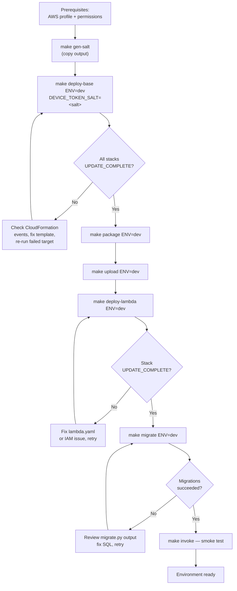

# Runbook: First-Time Environment Deploy

**Audience:** Developer / Webmaster.

This runbook covers deploying the full Outdoor Sports Club infrastructure and Lambda functions to a new environment (`dev` or `prod`) for the first time. For code-only redeployments after the environment already exists, see [lambda-code-deploy.md](lambda-code-deploy.md).

---

## Overview



---

## Prerequisites

Before running any `make` commands:

* AWS CLI installed and the `outdoorsportsclub` profile configured (`aws configure --profile outdoorsportsclub`)
* IAM user or role has permissions for: `cloudformation:*`, `lambda:*`, `s3:*`, `secretsmanager:*`, `rds-data:*`, `sts:GetCallerIdentity`
* You are deploying to `us-east-1` (the only supported region for both `dev` and `prod`)
* The repo is checked out and you are on the `main` branch at the commit you intend to deploy

---

## Step 1 — Generate a device token salt

The device token salt is a random secret used to HMAC kiosk device tokens. It must be generated once and stored in AWS Secrets Manager on first deploy.

```bash
make gen-salt
```

Copy the output (a 64-character hex string). You will pass it as `DEVICE_TOKEN_SALT` in the next step. Store a copy in a secure location (password manager) — if it is lost and Secrets Manager is updated with a new value, all existing device tokens are invalidated and every kiosk must be re-paired.

> On subsequent deploys, omit `DEVICE_TOKEN_SALT` — CloudFormation uses `UsePreviousValue` and does not overwrite the secret.

---

## Step 2 — Deploy all supporting stacks

```bash
make deploy-base ENV=dev DEVICE_TOKEN_SALT=<output-from-step-1>
```

This deploys stacks in dependency order:

| Order | Stack | Template |
| :--- | :--- | :--- |
| 1 | `osc-kms-dev` | `infra/stacks/kms.yaml` |
| 2 | `osc-secrets-dev` | `infra/stacks/secrets.yaml` |
| 3 | `osc-sns-dev` | `infra/stacks/sns.yaml` |
| 3 | `osc-s3-dev` | `infra/stacks/s3.yaml` |
| 4 | `osc-aurora-dev` | `infra/stacks/aurora.yaml` |
| 5 | `osc-backup-dev` | `infra/stacks/backup.yaml` |
| 5 | `osc-iam-kiosk-dev` | `infra/stacks/iam/lambda-kiosk-roles.yaml` |
| 6 | `osc-artifacts-dev` | `infra/stacks/artifacts.yaml` |

**Verify:** in the AWS Console → CloudFormation, confirm every stack shows `UPDATE_COMPLETE` or `CREATE_COMPLETE` before proceeding. If any stack fails, check **Events** for the failing resource, fix the template, and re-run the specific target (e.g., `make deploy-aurora ENV=dev`).

> Aurora provisioning takes 3–5 minutes. The `deploy-aurora` target will block until CloudFormation signals completion.

---

## Step 3 — Package Lambda handlers

```bash
make package ENV=dev
```

Zips each handler together with its `_auth.py` dependency into `dist/lambda/`. No AWS calls are made at this step.

---

## Step 4 — Upload ZIPs to S3

```bash
make upload ENV=dev
```

Copies each ZIP from `dist/lambda/` to `s3://osc-lambda-artifacts-dev-<account-id>/`. The account ID is resolved automatically via `aws sts get-caller-identity`.

---

## Step 5 — Deploy Lambda function stack

```bash
make deploy-lambda ENV=dev
```

Deploys `osc-lambda-dev` from `infra/stacks/lambda.yaml`, which creates all Lambda functions referencing the ZIPs uploaded in Step 4.

**Verify:** confirm `osc-lambda-dev` shows `UPDATE_COMPLETE` or `CREATE_COMPLETE`.

---

## Step 6 — Run database migrations

```bash
make migrate ENV=dev
```

Queries CloudFormation for the Aurora cluster ARN and master secret ARN, then runs `scripts/migrate.py`, which executes all files in `db/migrations/` in filename order via the RDS Data API.

**Verify:** `migrate.py` prints each migration filename and `OK` or raises on failure. Confirm all 19 migrations complete without error.

> Migrations are idempotent — `IF NOT EXISTS` guards are used throughout. Re-running against an already-migrated cluster is safe.

---

## Step 7 — Smoke test

Invoke a handler directly to confirm the end-to-end path (Lambda → Aurora) is functional:

```bash
make invoke FUNCTION=osc-kiosk-range-lanes-dev \
            PAYLOAD='{"headers":{"x-device-token":"invalid"},"httpMethod":"GET"}'
```

Expected response: `{"statusCode": 403, ...}`. A 403 confirms the Lambda is running and can reach Aurora (the device token check queries the `devices` table).

---

## Shortcut — full first deploy in two commands

```bash
make deploy-all ENV=dev DEVICE_TOKEN_SALT=<salt>
make migrate ENV=dev
```

`deploy-all` runs `deploy-base → package → upload → deploy-lambda` in sequence. Use this only on a clean first deploy; it does not handle partial failures gracefully.
