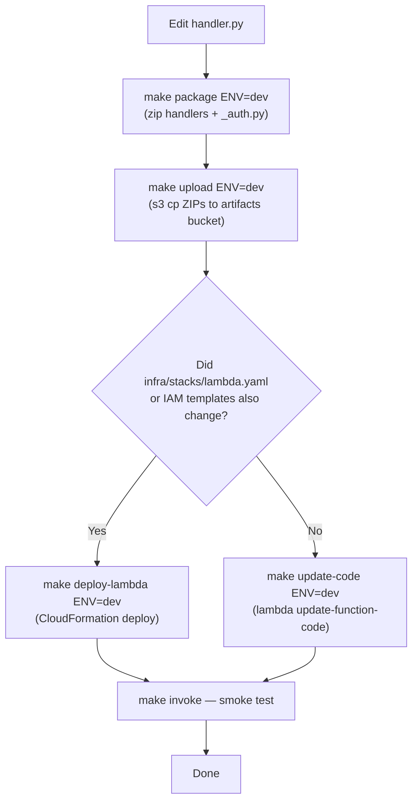

# Runbook: Lambda Code Deployment

**Audience:** Developer / Webmaster.

This runbook covers deploying updated Lambda handler code to an existing environment. Use this after the environment is already running (see [first-deploy.md](first-deploy.md) for initial setup).

---

## Overview

There are two code deployment paths depending on whether the Lambda CloudFormation template (`infra/stacks/lambda.yaml`) changed alongside the handler code:



> **Critical:** CloudFormation's `deploy` command only deploys when the template or parameters change. If you re-run `make deploy-lambda` after a code-only change, CloudFormation reports `No changes to deploy` and exits with success — but Lambda is still running the old ZIP. Always use `make update-code` for code-only changes.

---

## Step 1 — Package handlers

```bash
make package ENV=dev
```

Zips each handler with its `_auth.py` dependency into `dist/lambda/`. This step has no AWS calls and always runs fast.

---

## Step 2 — Upload ZIPs to S3

```bash
make upload ENV=dev
```

Copies each ZIP to `s3://osc-lambda-artifacts-dev-<account-id>/`. This overwrites any previous ZIPs at the same keys.

---

## Step 3 — Push new code to Lambda

### If `infra/stacks/lambda.yaml` (or any IAM template) also changed:

```bash
make deploy-lambda ENV=dev
```

CloudFormation updates the stack. Lambda picks up the new ZIP from S3 as part of the resource update.

### If only handler code changed (no template change):

```bash
make update-code ENV=dev
```

Calls `aws lambda update-function-code` for each function directly, bypassing CloudFormation. Lambda immediately begins serving the new code on the next invocation.

---

## Step 4 — Smoke test

```bash
make invoke FUNCTION=osc-kiosk-range-lanes-dev \
            PAYLOAD='{"headers":{"x-device-token":"invalid"},"httpMethod":"GET"}'
```

Expected: `{"statusCode": 403, ...}`. Confirms the new code is live and Aurora connectivity is intact.

For a specific handler under development, invoke it directly with a representative payload:

```bash
make invoke FUNCTION=osc-kiosk-checkin-dev \
            PAYLOAD='{"headers":{"x-device-token":"<token>"},"httpMethod":"POST","body":"{\"member_num\":\"TEST\"}"}'
```

---

## Deploying to prod

Repeat all steps with `ENV=prod`:

```bash
make package ENV=prod
make upload ENV=prod
make update-code ENV=prod    # or deploy-lambda if template changed
```

> Only deploy to `prod` from a commit that has been verified in `dev`. There is no automatic promotion — prod deploys are always manual.

---

## Updating a single handler's code (faster iteration)

`make update-code` iterates over all handlers. To push a single function during active development:

```bash
ACCOUNT_ID=$(aws sts get-caller-identity --query Account --output text --profile outdoorsportsclub)

aws lambda update-function-code \
  --function-name osc-kiosk-checkin-dev \
  --s3-bucket osc-lambda-artifacts-dev-${ACCOUNT_ID} \
  --s3-key kiosk-checkin.zip \
  --profile outdoorsportsclub --region us-east-1 \
  --output text --query FunctionName
```

This is equivalent to one iteration of the `update-code` loop and is useful when iterating on a single handler without touching the others.
